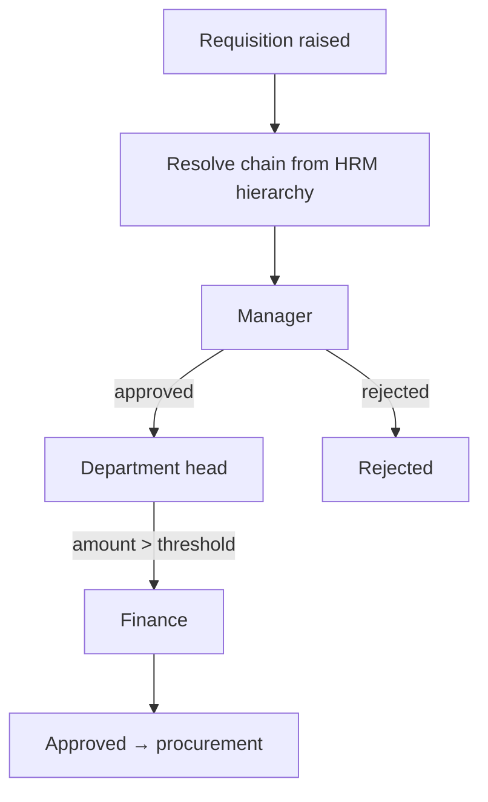

Approval workflows look trivial until you meet the real org chart. Different
departments have different chains, approvers change roles, and "two levels up" means
something different for everyone. Hard-code the levels and you'll be editing code
every reorg — a lesson from an earlier [procurement system](/posts/procurement-system-nationwide-retailer/)
that wired its approvals in by hand. The durable approach is to **resolve the chain
dynamically from the organizational hierarchy**. Here's how, drawn from [Assets Nexus](/projects/assets-nexus/),
which routed requisitions for 250+ employees and field agents.

## The problem

A requisition (or leave request, or expense) must travel "up the chain" until it
hits someone authorized to approve it. But the chain isn't fixed — it depends on who
raised it, their department, the amount, and the current org structure. Encoding that
as static `if level == 1` rules guarantees constant maintenance.

## How to approach it

Treat the **org hierarchy as data** (sourced from your HRM/LDAP directory) and
**derive** the approver chain at request time by walking it, applying policy as you
go.

## What tech to use where

- **Single source of truth for org data.** Pull the hierarchy and roles from HRM/LDAP
  rather than duplicating it. Assets Nexus drove its chains from the HRM-sourced
  structure, with LDAP/OAuth for identity.
- **Resolve the chain at request time.** Walk from the requester up their reporting
  line, inserting approvers per [policy](/posts/dynamic-versioned-policy-engine/) (e.g.
  amount thresholds add a finance step). The chain reflects the org *as it is now*,
  automatically.
- **Role-based, not person-based, steps.** Approvals target a *role* ("department
  head"), resolved to the current holder — so staff changes don't break in-flight
  requests.
- **Persist each decision.** Store every approval/rejection with actor and timestamp:
  an audit trail and the resume point if a step is revisited.
- **Model it as a state machine** (see the workflow-engine post) so each approval is a
  clean transition.

## Pitfalls to watch for

- **Hard-coded levels.** The fastest path to permanent maintenance. Derive, don't
  hard-code.
- **Person-based approvers.** Pin a step to a named user and it breaks the moment they
  move teams or leave.
- **Ignoring edge cases.** What if the requester *is* the manager? What if an approver
  is on leave? Delegation and self-approval rules need explicit handling.
- **A stale hierarchy copy.** If you cache org data, have a clear refresh path or
  approvals route to the wrong people.

## Takeaways

Drive approvals from the live org hierarchy: hierarchy-as-data from HRM/LDAP,
chains resolved per request, role-based steps, and a persisted decision trail.
Done right, a reorg changes who approves what with **zero code changes** — the
workflow simply follows the new structure.

> See it routing real requisitions in the [Assets Nexus case study](/projects/assets-nexus/).
