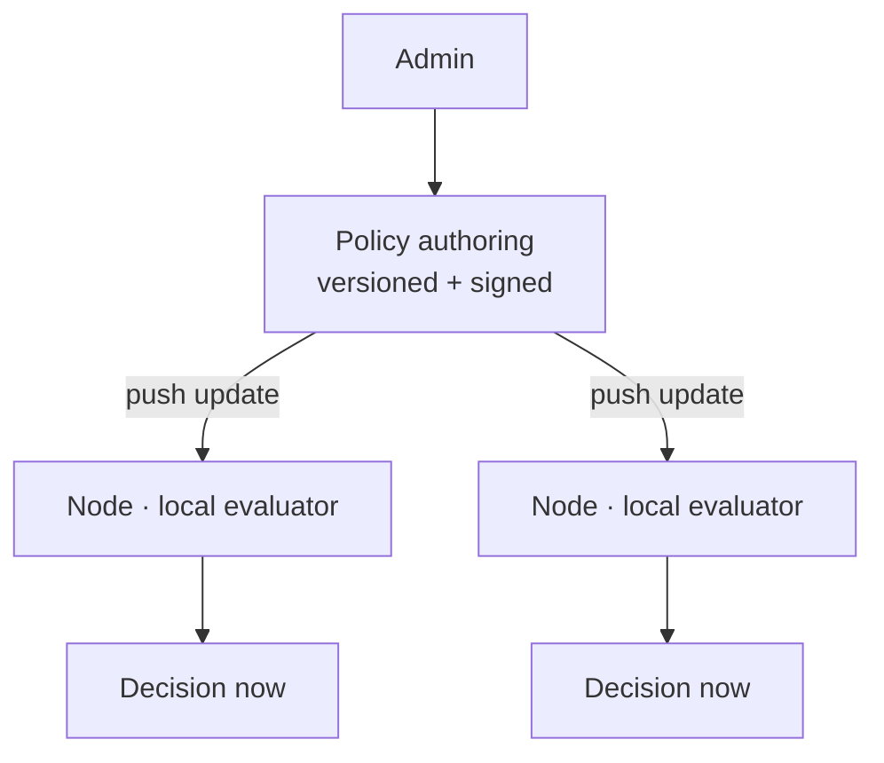

The moment business or security rules are hard-coded, every rule change becomes a
deploy. For a fleet of agents that need rules to change *now* — and to keep enforcing
even when offline — that's a non-starter. The answer is a policy engine: rules as
**data**, managed centrally but **evaluated locally**. Here's the design, drawn from
[Data Citadel](/projects/data-citadel/).

## The problem

Two requirements pull in opposite directions. You want a **single place** to author
and update rules across the whole fleet. But you also need each node to make
decisions **instantly and independently** — a node can't phone home for every event,
and it must keep working with no connectivity at all.

## How to approach it

Separate **authoring** from **evaluation**. Policies are authored, versioned, and
signed centrally, then distributed to nodes that each carry a local evaluator. The
network delivers updates; it is never on the critical path of a decision.

## What tech to use where

- **Rules as data, not code.** Represent policy as structured data (conditions →
  actions) the evaluator interprets. Changing a rule is a data update, not a release.
- **Versioning.** Every policy has a version. Nodes report which version they run, so
  you can confirm a rollout reached the whole fleet — and roll back cleanly.
- **Signed distribution.** A policy that can lock or wipe a machine is dangerous if
  forged. Sign policies so nodes only apply trusted updates. Data Citadel pushed
  signed policy over an mTLS channel.
- **Local evaluation + offline fallback.** The evaluator runs on the node against the
  last known policy, so enforcement survives disconnection. Queue events to sync on
  reconnect.
- **Sensible defaults.** Define what happens when no rule matches — and, for security,
  fail safe.

## Pitfalls to watch for

- **Centralized evaluation.** If nodes call home to decide, latency and outages break
  enforcement. Evaluate at the edge.
- **Unsigned/unversioned policy.** Without signing you can't trust updates; without
  versioning you can't tell what's actually deployed.
- **Rules that need a deploy.** If adding a rule means shipping code, it isn't a
  policy engine yet.
- **No rollout visibility.** You must be able to answer "which version is each node
  running?"

## Takeaways

Make rules data, version and sign them, distribute from one place, and evaluate
locally so decisions are instant and survive offline. "Evaluate locally, manage
centrally" gives you fleet-wide control without making the network a dependency of
every decision.

> See it enforced across a device fleet in the [Data Citadel case study](/projects/data-citadel/).
