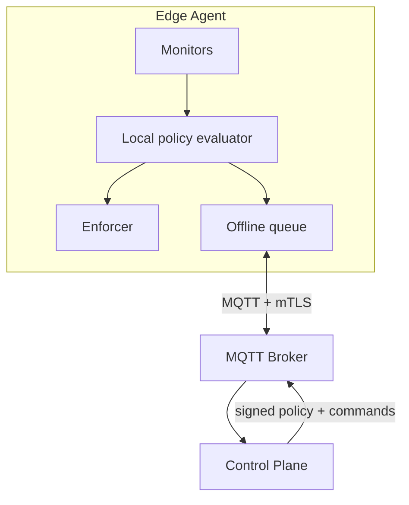

When you need to monitor and control a fleet of machines in real time — endpoints,
devices, agents — HTTP polling falls apart fast. You want push, not poll; secure
identity, not shared secrets; and behaviour that survives a dropped connection.
This is the territory where **MQTT over mutual TLS** shines.

This is the architecture behind [Data Citadel](/projects/data-citadel/), an
endpoint security tool I built that controlled **50+ machines** holding
confidential data, locking a compromised endpoint down in **under ~5 minutes**.

## The problem

A control plane has to do two things at once: **receive** a stream of events from
every agent, and **push** commands back to any agent instantly. It must keep
working when an agent goes offline, and — because it's security-critical — it must
trust only agents that are who they say they are.

## How to approach it

Think in three layers: **agents** at the edge, a **broker** for transport, and a
**control plane** that decides. The design principle that matters most:
**evaluate locally, manage centrally.**

## What tech to use where

- **MQTT for transport.** Lightweight pub/sub built for exactly this: many clients,
  unreliable networks, low overhead. Agents publish events to topics; the control
  plane publishes commands back. No polling. That event stream is also your
  [telemetry](/posts/observability-logs-metrics-traces/) — the same channel tells you
  the fleet's health, not just its state.
- **Mutual TLS for identity.** Don't authenticate fleets with a shared token — one
  leak compromises everyone. Give each agent its **own client certificate** so the
  broker authenticates *and* the agent verifies the server. Identity becomes
  cryptographic, per-device, and revocable.
- **Local-first evaluation.** Agents evaluate policy **on the device** so
  enforcement keeps working with no connectivity, queuing events to sync on
  reconnect. The network is an optimization, not a dependency.
- **Central, signed policy distribution.** Policies are managed in one place,
  versioned, signed, and pushed over the same secure channel — so one update
  propagates to the whole fleet without redeploying agents.

## Pitfalls to watch for

- **Securing the channel is the whole game.** A control plane that can lock or wipe
  machines is a weapon if hijacked. mTLS, signed payloads, and least-privilege
  topics are non-negotiable.
- **Fail-secure vs fail-open.** Decide explicitly what an offline agent does. For
  security, fail toward safe (keep enforcing the last known policy).
- **Tamper resistance.** If a user can kill the agent, you have no control. Run it
  as a protected service and detect tampering.
- **Broker as a bottleneck/SPOF.** Cluster it; plan topic scaling before the fleet
  grows.

## Takeaways

For real-time fleet control, reach for MQTT (push over poll), mutual TLS
(per-device cryptographic identity over shared secrets), and local-first
evaluation (resilience over connectivity). Manage policy centrally but enforce it
at the edge — that combination gives you instant control without making the network
a single point of failure.

> See it in practice in the [Data Citadel case study](/projects/data-citadel/).
