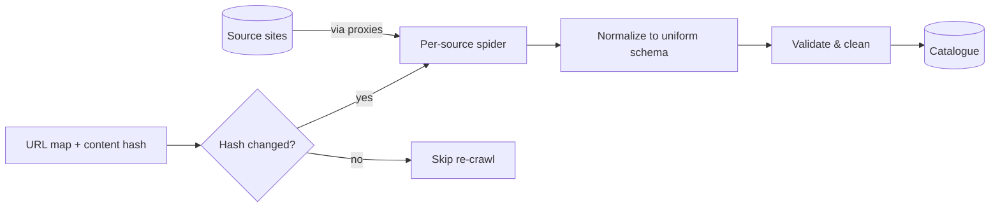

Scraping one website is a script. Scraping **thousands** of heterogeneous
websites into a single clean schema — and keeping it fresh — is a system. The
hard parts are rarely the parsing; they're structure variability, change
detection, rate limits, and data quality. Here's how a backend engineer should
think about it.

This is the approach behind [Study Giveaway](/projects/study-giveaway/), where I
built a catalogue of **1,500+ universities across 30+ countries** (~17,000 courses)
that stayed continuously up to date.

## The problem

Every source is shaped differently, yet your database wants one consistent schema.
Sources change without warning, block aggressive crawlers, and contain dirty data.
A naive "crawl everything every night" approach is slow, fragile, and rude to the
sites you depend on.

## How to approach it

Separate three concerns that beginners tangle together:

1. **Extraction** — getting raw data from each source (source-specific).
2. **Normalization** — mapping raw data into your uniform schema (one place).
3. **Quality** — validating and cleaning before anything is trusted.

## What tech to use where

- **Scrapy over hand-rolled requests.** You get concurrency, retries, throttling,
  and pipelines for free. I wrote a **spider variant per source** — same output
  schema, different selectors — so the messy per-site logic stays isolated.
- **Content-hash change detection.** Cache each page's **URL map and a SHA of its
  content**; on the next run, re-scrape only when the hash changes. This turns a
  full nightly crawl into cheap incremental updates and slashes load on both ends.
- **Proxies for rate limiting.** Rotate IPs/user-agents and back off politely.
  Respect the target's limits — getting blocked is a data outage.
- **A normalization layer** that all spiders feed into, so schema rules live in one
  place rather than scattered across spiders.
- **Search after storage.** Once the catalogue is clean, layer Postgres full-text
  or Elasticsearch on top for discovery (a topic of its own).

## Pitfalls to watch for

- **Brittle selectors.** Sites redesign. Isolate selectors per source and alert when
  a spider's yield drops to zero — that's your "site changed" signal.
- **Silent data drift.** Automated quality checks should gate ingestion. On Study
  Giveaway, automation got data ~95% clean; a thin layer of **manual cleanup** took
  it to ~100% for the fields that mattered.
- **Dedup and identity.** The same university from two sources must resolve to one
  record. Decide your natural keys early.
- **Crawling too hard.** Incremental crawls + backoff aren't just polite — they keep
  you unblocked and your pipeline cheap.

## Takeaways

Treat scraping as a pipeline, not a script: source-specific extraction, a single
normalization layer, hash-based incremental crawls, and quality gates before data
is trusted. The goal isn't to scrape everything constantly — it's to keep a clean,
uniform dataset fresh with the least work and the lightest footprint.

> See the full pipeline in the [Study Giveaway case study](/projects/study-giveaway/).
