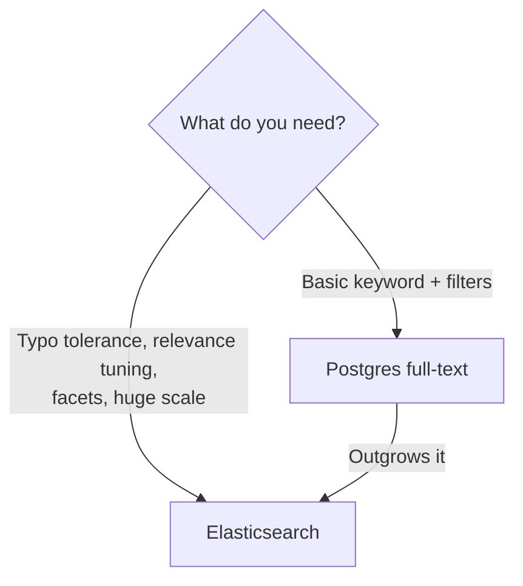

"We need search" is one of the most under-scoped requirements in backend work.
Reach for Elasticsearch too early and you've bought a second datastore to operate,
sync, and keep consistent. Lean on `LIKE '%query%'` too long and search falls over
the moment the catalogue grows. The right answer is usually a progression — and
knowing where the line is. Here's the framework, drawn from
[Study Giveaway](/projects/study-giveaway/), where search spanned ~17,000 courses.

## The problem

Search has many dimensions — relevance ranking, typo tolerance, faceting, filters,
autocomplete, scale. Different tools sit at different points on that curve, and the
cost of operating them differs by an order of magnitude.

## How to approach it

Start with the database you already have. **Move up only when a real requirement
forces it.**

## What tech to use where

**Postgres full-text search — start here.**
- Built into the database you already run; no extra system to sync or operate.
- `tsvector`/`tsquery` with a **GIN index** handles stemming, ranking, and weighting.
- Combines naturally with your SQL filters (price, country, category) in one query.
- Great up to mid-sized catalogues and moderate query volume.

**Elasticsearch — move up when you need:**
- **Typo tolerance / fuzzy** matching and rich relevance tuning.
- **Faceted search** and aggregations at scale.
- **High query volume** you want off your primary database.
- Very large corpora where Postgres indexes strain.

On Study Giveaway both were used: **Postgres full-text** for tightly filtered,
structured queries, and **Elasticsearch** for fast, forgiving discovery across the
catalogue — each playing to its strength.

## Pitfalls to watch for

- **Adopting Elasticsearch by default.** It's a distributed system: indexing
  pipelines, cluster ops, and the eventual-consistency gap between it and your DB.
  Don't take that on without a reason.
- **Forgetting the GIN index.** Postgres FTS without the right index is just a slow
  scan in disguise.
- **Dual-source drift.** The instant you copy data into a search engine, you own
  keeping it in sync. Have a clear reindex/update path.
- **Treating search as static.** Relevance needs tuning against real queries.

## Takeaways

Default to Postgres full-text search — it's free, transactional, and joins your
filters. Graduate to Elasticsearch when typo tolerance, relevance tuning, faceting,
or scale genuinely demand it. Choosing search is really choosing how much
operational complexity the requirement is worth.

> See both in use in the [Study Giveaway case study](/projects/study-giveaway/).
