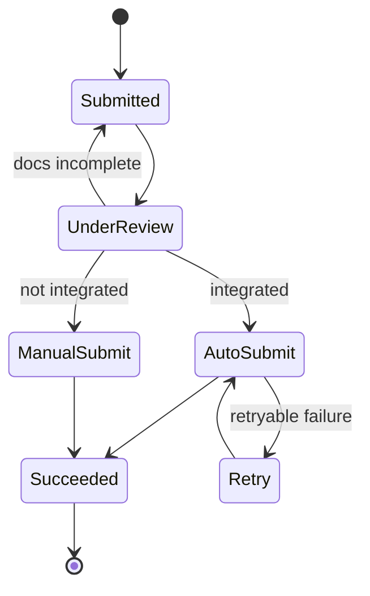

Plenty of real-world processes are *mostly* automatable — but not entirely. Some
steps must fall back to a human, and any step can fail and need a retry. Modelling
that cleanly, instead of scattering `if` statements across the codebase, is what
separates a maintainable system from a pile of special cases. Here's how to think
about it, drawn from [Study Giveaway](/projects/study-giveaway/), whose application
flow branched between automated API submission and manual agents.

## The problem

A process where "happy path = automated, edge case = human, failures = retry" gets
ugly fast if you encode it as branching logic inline. State becomes implicit, you
can't tell where a given item is, and retries become copy-pasted try/except blocks.

## How to approach it

Model the process as an explicit **state machine**: a finite set of states, and
defined transitions between them. The automated/manual split and the retry behaviour
become *transitions*, not tangled conditionals.

## What tech to use where

- **An explicit state field**, not inferred status. Every item knows exactly which
  state it's in; transitions are the only way to move. This makes the whole system
  observable and debuggable.
- **A routing/decision step** that picks the path (automated vs manual) based on
  data — e.g. "is this destination integrated?" On Study Giveaway, integrated
  universities went out via API; the rest were routed to a human operator.
- **Idempotent transitions + bounded retries.** Failures are expected. Make each
  transition safe to re-run, and cap retries with a backoff and a terminal
  "needs attention" state — don't retry forever.
- **A human task queue** for the manual path: a clear work list operators pull from,
  with the item's full context attached.
- **An audit trail** of every transition — who/what moved it and when.

## Pitfalls to watch for

- **Implicit state.** If you can't query "what state is X in?" you don't have a
  workflow engine, you have spaghetti.
- **Unbounded retries.** A poison item retried forever burns resources and hides the
  real failure. Always have a dead-end state a human can inspect.
- **Mixing decision and execution.** Keep "which path?" separate from "do the work"
  so each is testable.
- **No human escape hatch.** Even automated paths need a manual override.

## Takeaways

When a process mixes automation, human steps, and failure, model it as a state
machine: explicit states, well-defined transitions, idempotent retries with a
ceiling, and a human queue for the fallback path. The branching logic that would
have sprawled across your code becomes a small, observable diagram.

> See the dual automated/manual flow in the [Study Giveaway case study](/projects/study-giveaway/).
