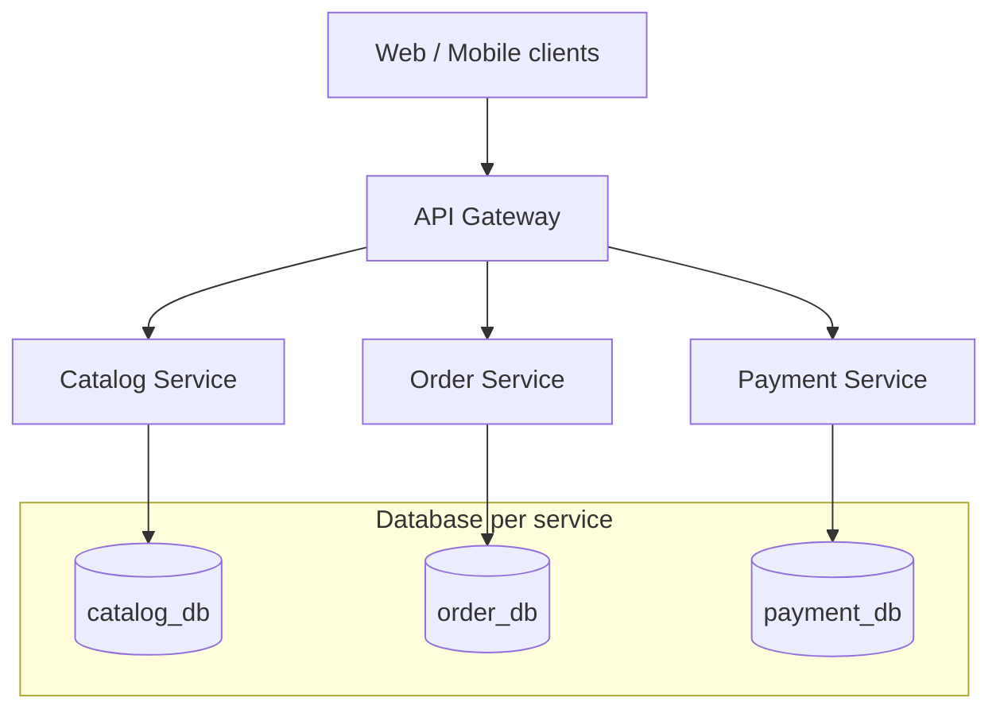

Microservices are not a starting point — they are a response to pain. The fastest
way to sink a young product is to split it into a dozen services before you
understand its boundaries. But the opposite failure is just as real: a monolith
that can no longer scale, deploy, or be owned by more than one team. Knowing
*when* to split, and *how* to do it without creating a distributed mess, is one
of the more consequential calls a backend engineer makes.

This is the playbook I used to re-architect [SHOB.COM.BD](/projects/shob/)
— a B2B/B2C marketplace — from a monolith into services behind an API gateway.

## When to actually split

Split when **at least one** of these is true, not before:

- **Scaling pressure is uneven.** One part of the system (checkout, search) needs
  far more resources than the rest, and scaling the whole monolith to feed it is
  wasteful.
- **Deploys are coupled.** A change to one feature forces a full redeploy and
  risks unrelated areas.
- **Team boundaries are forming.** Multiple teams are stepping on each other in
  one codebase.

If none of these hurt yet, stay monolithic. A well-structured Django monolith with
clear app boundaries will take you remarkably far.

## How to approach it

Use the **strangler pattern**: don't rewrite, carve. Identify a **bounded context**
(orders, payments, catalog), extract it into its own service, route traffic to it
through a gateway, and repeat. The monolith shrinks one slice at a time, and you
can stop whenever the remaining core is comfortable.

## What tech to use where

- **API gateway** — put one in front (Kong, or an ingress + gateway). It gives you
  one entry point for routing, auth, rate limiting, and load balancing. Don't make
  clients talk to services directly. Each service still needs an
  [API that ages well](/posts/designing-rest-apis-that-age-well/) — a stable contract
  matters even more once it's an inter-service boundary.
- **Database per service.** This is the part teams skip — and regret. Shared tables
  re-couple the services you just separated. On SHOB each service owned its own
  database (on a single Postgres server, to keep ops simple) so schemas could evolve
  independently.
- **Synchronous vs asynchronous.** REST/gRPC between services is simple but couples
  availability — if Payment is down, Order feels it. A message broker decouples them
  but adds real operational weight. **This is a trade-off, not a default.** On SHOB
  we deliberately stayed synchronous and skipped the broker; the simplicity was worth
  the coupling at that stage.
- **Auto-scaling.** Make services stateless so they scale horizontally. SHOB's cluster
  added instances at 90% load to absorb ~170K concurrent users during sale events.

## Pitfalls to watch for

- **Premature splitting.** Microservices tax you with network failures, distributed
  debugging, and data consistency — and you'll need real
  [observability](/posts/observability-logs-metrics-traces/) to operate them at all.
  Earn them.
- **Distributed transactions.** The moment a flow spans services (order → payment →
  loyalty), you can't lean on a DB transaction. Design for eventual consistency and
  idempotent retries instead.
- **A "distributed monolith."** If every request fans out to five services and they
  share a database, you have all the cost of microservices and none of the benefit.
- **Forgetting the gateway is a single point.** Make it highly available.

## Takeaways

Start monolithic. Split along bounded contexts, one slice at a time, behind a
gateway, with a database per service. Treat synchronous-vs-async messaging as an
explicit decision, not a reflex. Every boundary you add should buy you independent
scaling, deployment, or ownership — if it doesn't, don't add it.

> See this applied end-to-end in the [SHOB.COM.BD case study](/projects/shob/).
