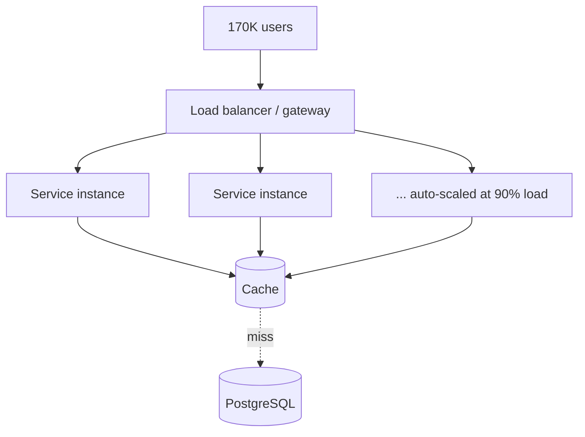

Traffic spikes don't announce themselves politely. A promotional offer can take a
backend from a few thousand users to **170K concurrent** in minutes. Surviving that
isn't about one clever trick — it's about removing bottlenecks layer by layer so the
system can grow sideways on demand. Here's how a backend engineer should think about
it, drawn from scaling [SHOB.COM.BD](/projects/shob/).

## The problem

A single big server hits a ceiling — CPU, memory, or connections — and everyone
behind it slows down or errors out. Vertical scaling (a bigger box) buys time but not
elasticity. You need to scale **horizontally** and make sure nothing in the request
path is a hidden serial chokepoint.

## How to approach it

Make services **stateless**, put them behind a **load balancer**, and let the cluster
**add instances automatically** under load. On SHOB the cluster scaled out when load
crossed **90%**, absorbing offer-day spikes without manual intervention.

## What tech to use where

- **Stateless app servers.** No session state on the box — push it to a shared store
  — so any instance can serve any request and the autoscaler can add/remove freely.
- **Load balancing at the gateway.** One entry point distributing across instances,
  with health checks so dead instances drop out.
- **Autoscaling on a real signal.** Scale on CPU/load (SHOB used a 90% threshold).
  Tune the cooldown so you don't thrash.
- **The database is the usual ceiling.** App servers scale cheaply; your DB doesn't.
  Add indexes for hot queries, use **connection pooling** (instances × connections
  adds up fast), and add **read replicas** if reads dominate.
- **Cache the hot path.** A cache in front of expensive reads is often the single
  biggest win — it takes pressure off the DB exactly when traffic peaks.

## Pitfalls to watch for

- **Scaling app servers into a DB wall.** More instances just means more clients
  hammering one database. Pool connections and cache first.
- **Stateful surprises.** Local file writes or in-process caches break the moment you
  run multiple instances.
- **Cold autoscaling.** New instances take time to boot and warm up; spikes can
  outrun them. Pre-scale for known events (like sales) instead of reacting.
- **No load testing.** You don't know your ceiling until you simulate the spike.

## Takeaways

Scaling is bottleneck removal: stateless services behind a load balancer, autoscaled
on a real signal, with the database protected by pooling, indexing, replicas, and a
cache on the hot path. Architect for horizontal growth early — retrofitting
statelessness under fire is far more painful than building it in.

> See it at 170K concurrent users in the [SHOB.COM.BD case study](/projects/shob/).
