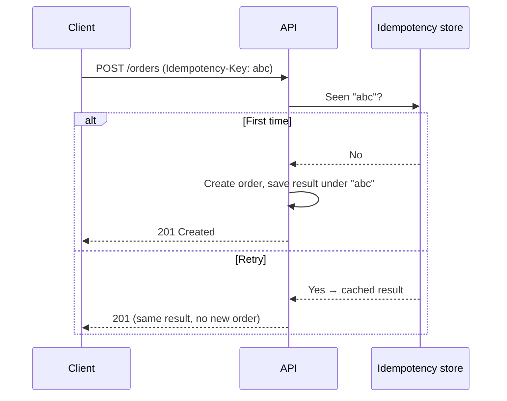

In a distributed system, **retries are not an edge case — they are the norm**. A
network blips, a client times out and resends, a queue redelivers a message. If your
operation isn't idempotent, that innocent retry becomes a double charge, a duplicate
order, or two emails. Idempotency is the property that makes retries safe, and
designing for it is a baseline senior-backend skill.

## The problem

The client sends "create order." The request succeeds on the server, but the response
is lost on the way back. The client, seeing a timeout, retries. Without protection,
you've now created two orders and charged the customer twice. The failure wasn't in
your logic — it was in assuming the network is reliable.

## How to approach it

Make the *effect* of an operation happen **at most once**, no matter how many times
it's delivered. The cleanest general mechanism is an **idempotency key**: the client
generates a unique key per logical operation and sends it with every retry. The server
records the key with the result; a repeat key returns the stored result instead of
re-executing.

## What tech to use where

- **Idempotency keys for unsafe operations.** `POST`/charges/sends should accept an
  `Idempotency-Key`. Store key → result with a TTL.
- **Lean on HTTP semantics.** `GET`, `PUT`, and `DELETE` are idempotent by design —
  prefer `PUT` with a client-supplied ID over `POST` when you can.
- **Database constraints as a backstop.** A unique constraint on a natural key turns a
  duplicate insert into a catchable error instead of a duplicate row.
- **Idempotent consumers.** Queues deliver *at least once*. Give each message an ID and
  keep a processed-IDs table so reprocessing is a no-op.
- **Upserts** (`INSERT ... ON CONFLICT`) for "create or update" semantics.

## Pitfalls to watch for

- **Retrying non-idempotent operations.** A retry layer in front of a non-idempotent
  endpoint is a duplication machine.
- **Race conditions on the key.** Two concurrent requests with the same key must not
  both execute — reserve the key atomically (unique insert or a lock).
- **Key scope and expiry.** Decide what a key identifies and how long results are kept;
  too short and a slow retry re-executes.
- **Partial side effects.** If an op writes a row *and* calls a third party, make the
  whole thing replay-safe, not just the DB write.

## Takeaways

Assume every request can arrive more than once and design so it doesn't matter:
idempotency keys for unsafe writes, HTTP idempotent verbs where possible, unique
constraints as a safety net, and dedup in your consumers. On a payment-bearing flow
like [SHOB.COM.BD](/projects/shob/)'s checkout — order, payment, and delivery across
services — this is the difference between a robust system and a customer charged
twice.
