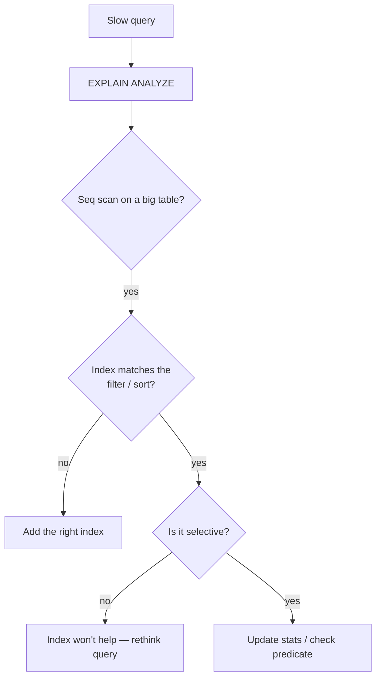

Almost every "the database is slow" ticket comes down to indexing — and almost every
engineer has added an index that the query planner then ignored. Understanding *why*
indexes help, and *why they sometimes don't*, is one of the highest-leverage skills a
backend engineer can build. Here's the mental model.

## The problem

A query that was instant on 10K rows crawls at 10M. You add an index on the column in
the `WHERE` clause… and nothing changes. The index exists, but the planner still does
a sequential scan. Why?

## How to approach it

An index is a sorted lookup structure (usually a B-tree) that lets the database find
rows without reading the whole table. The planner uses it **only when it believes it's
cheaper** than scanning. So the real questions are: does an index exist that *matches
the query shape*, and is it *selective enough* to be worth using?

## What tech to use where

- **Read the plan first.** `EXPLAIN ANALYZE` is the ground truth. Never guess at
  indexing — measure what the planner actually does.
- **Composite index column order matters.** An index on `(a, b)` serves filters on `a`
  and `a, b`, but **not** on `b` alone (the leftmost-prefix rule). Order columns by how
  you query them.
- **Selectivity decides usage.** Indexing a boolean or low-cardinality column rarely
  helps — the planner correctly prefers a scan. Index columns that narrow results a lot.
- **Specialized indexes.** `GIN` for full-text and JSONB, partial indexes for "hot"
  subsets (`WHERE active`), expression indexes when you filter on `lower(email)`.
- **Covering indexes** let an index-only scan answer a query without touching the table.

## Pitfalls to watch for

- **Functions on the column.** `WHERE lower(email) = ...` ignores a plain index on
  `email` — index the expression instead.
- **Over-indexing.** Every index slows writes and costs storage. Index for real query
  patterns, not "just in case."
- **Stale statistics.** The planner relies on stats; after big data changes, run
  `ANALYZE` so it estimates correctly.
- **Low-selectivity hope.** No index makes "fetch half the table" fast — that's a query
  design problem.

## Takeaways

Indexing is a conversation with the query planner: match the index to the query shape,
respect the leftmost-prefix rule, index selective columns, and reach for `GIN`/partial/
expression indexes when the data calls for it — then verify with `EXPLAIN ANALYZE`.
This is exactly the work that kept search fast over ~17,000 records in
[Study Giveaway](/projects/study-giveaway/) and queries snappy across the per-service
databases in [SHOB.COM.BD](/projects/shob/).
