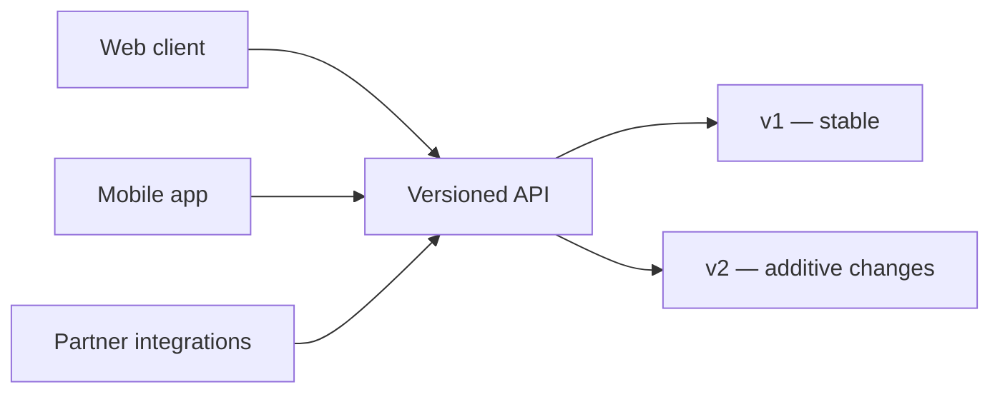

An API is a **contract**, and contracts are expensive to break. The moment a web app, a
mobile app, and partner integrations all depend on your endpoints, a careless change
becomes everyone's incident. Designing APIs that can grow without breaking clients is a
defining senior-backend skill — and it's mostly about decisions made early.

## The problem

You ship v1, clients integrate, and then requirements change: a field must be renamed,
a list grows too large to return whole, an error needs more detail. Do it carelessly and
you break released mobile apps you can't force-update. The constraint isn't "what's
clean today" — it's "what can evolve tomorrow."

## How to approach it

Design for **backward compatibility by default** and treat breaking changes as a
versioned event, not a quiet edit. A few principles carry most of the weight: model
resources consistently, paginate everything that can grow, keep errors uniform, and make
writes idempotent.

## What tech to use where

- **Versioning.** Pick one scheme and commit — URI (`/v1/`) is simplest and most
  visible; header-based is cleaner but easier to get wrong. **Additive changes** (new
  optional fields) don't need a new version; **removals/renames** do.
- **Pagination.** Never return an unbounded list. Use **cursor-based** pagination for
  large or fast-changing data — offset pagination degrades and skips/duplicates rows as
  data shifts.
- **Consistent error format.** One shape for every error (a code, a message, details) —
  RFC 7807 `application/problem+json` is a good default. Clients should parse errors one
  way, everywhere.
- **Don't leak internal models.** Serialize to explicit response schemas so a DB column
  rename isn't an API break.
- **Idempotency for writes** (see the idempotency post) so clients can retry safely.

## Pitfalls to watch for

- **Breaking changes without a version bump.** Renaming or removing a field breaks
  released clients silently.
- **Offset pagination at scale.** `OFFSET 100000` is slow and inconsistent under writes.
- **Inconsistent errors.** Different shapes per endpoint force brittle client handling.
- **Chatty or overstuffed responses.** Find the balance; let clients select fields if
  payloads vary widely.

## Takeaways

Treat the API as a long-lived contract: version deliberately, paginate everything,
standardize errors, decouple responses from your schema, and make writes idempotent. A
gateway-fronted API like [SHOB.COM.BD](/projects/shob/)'s — consumed by React, Flutter,
and B2B partners at once — only stays sane because the contract is stable and changes are
additive. Design it to age, and you'll spend far less time on forced migrations.
