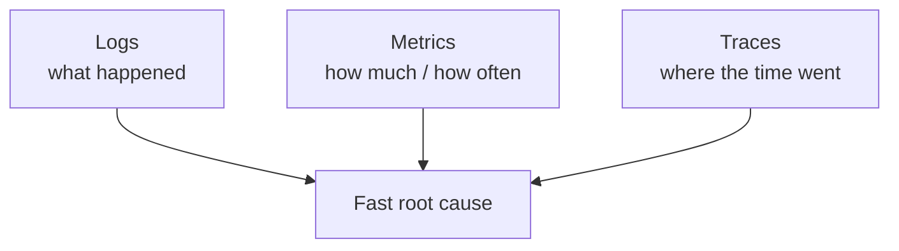

When production breaks at 2 a.m., the only thing that matters is how fast you can answer
*what's wrong and why*. That answer comes from observability — and a system you can't
observe is one you're operating blind — a [scraping pipeline](/posts/resilient-web-scraping-pipeline/)
that quietly starts returning empty is the canonical case: broken, but raising no
errors. Knowing **what** to instrument (not just which tool to buy) is a core
senior-backend skill.

## The problem

A request is failing. Is it the database, a downstream service, a bad deploy, a single
sick instance? Without the right signals you're reduced to guessing and redeploying.
With them, you go from symptom to cause in minutes.

## How to approach it

Lean on the **three pillars**, each answering a different question:

- **Logs** — discrete events. *What happened, exactly?*
- **Metrics** — aggregates over time. *How often, how fast, how many?*
- **Traces** — a request's path across services. *Where did the time/error go?*

## What tech to use where

- **Structured logging.** Emit JSON with consistent fields, not free-text. A **correlation
  ID** per request — propagated across services — lets you stitch one request's whole
  story together. Centralize logs so they're searchable (an **ELK**-style stack, as I
  used on [Study Giveaway](/projects/study-giveaway/), makes this practical).
- **Metrics that matter.** For request-driven services, track **RED** — Rate, Errors,
  Duration. For resources, **USE** — Utilization, Saturation, Errors. Alert on these, not
  on vanity counts. These are also the signals you
  [autoscale on](/posts/scaling-django-backend-to-170k-users/) — you can't scale on load
  you aren't measuring.
- **Distributed tracing.** In a microservice system, a single request crosses many
  services; tracing (OpenTelemetry-style) shows exactly which hop was slow or failed —
  invaluable for a gateway-fronted system like [SHOB.COM.BD](/projects/shob/).
- **Actionable alerts.** Alert on user-facing symptoms (error rate, latency, SLO burn),
  with enough context to act — not on every metric.

## Pitfalls to watch for

- **Logging everything or nothing.** Noise hides signal and costs money; silence leaves
  you blind. Log decisions and errors with context.
- **No correlation IDs.** Without them you can't follow one request across services —
  the single most common gap.
- **Alert fatigue.** Alerts that don't require action get ignored, including the real one.
- **Vanity metrics.** "Total requests" looks nice but rarely tells you something's wrong.

## Takeaways

Instrument deliberately: structured logs with correlation IDs, RED/USE metrics, and
distributed traces across service boundaries — then alert only on what's actionable. A
real-time security system like [Data Citadel](/projects/data-citadel/) or a high-traffic
marketplace like SHOB lives or dies on this: you can't respond to what you can't see.
