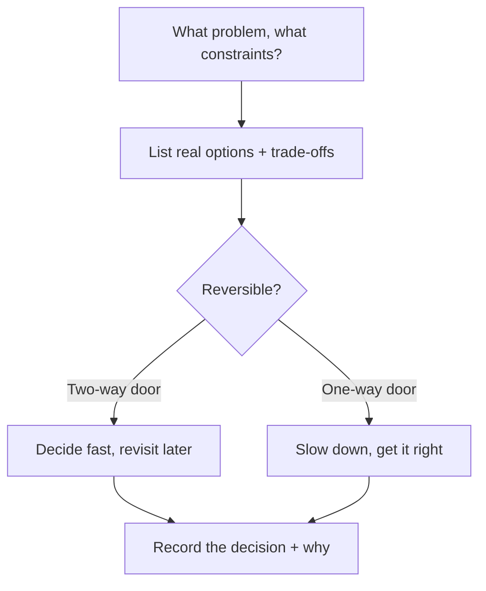

The decisions that hurt most aren't the wrong ones — they're the ones made for the wrong
reasons and never written down. Resume-driven architecture, cargo-culted patterns, and
"because it's modern" have sunk more backends than any single bad technology. Senior
engineering is less about knowing the answer and more about having a sound way to *reach*
one. Here's the framework I use.

## The problem

Two opposite failures. **Hype-driven decisions** — adopting microservices, a message
queue, or a trendy datastore because it's fashionable, not because the problem demands
it. And **analysis paralysis** — debating forever instead of deciding and moving. Both
cost you; the skill is steering between them.

## How to approach it

Frame the decision, weigh the options against your *current* constraints, decide, and
**write down why**.

## What this looks like in practice

- **Decide for the stage you're in.** On [SHOB.COM.BD](/projects/shob/) I
  [split a monolith into microservices](/posts/break-django-monolith-into-microservices/)
  — but only once uneven scaling and deploy coupling actually hurt. Splitting earlier
  would have bought distributed-systems pain with no payoff.
- **Choose the boring option deliberately.** On the same system I **skipped a message
  broker** and kept service calls synchronous. A broker is "more correct" on paper; the
  simplicity was worth more than the decoupling at that stage. That was a conscious
  trade-off, documented — not an oversight.
- **Start simple, earn the complexity.** On [Study Giveaway](/projects/study-giveaway/) I
  used Postgres full-text search first and only added Elasticsearch where it genuinely
  paid off — not the other way round.
- **Know one-way vs two-way doors.** Reversible decisions (a library choice) deserve speed;
  hard-to-reverse ones (your data model, your public API contract) deserve real care.

## Pitfalls to watch for

- **Resume-driven development.** Picking tech to learn it, not because the problem needs
  it, makes the *project* pay your tuition.
- **Premature complexity.** Every abstraction and service you add is permanent weight.
  Earn each one.
- **No record.** Six months later nobody remembers *why*, so the decision gets second-
  guessed or silently violated. A few lines of ADR — context, options, decision,
  consequences — prevents that.
- **Never revisiting.** A right call at 10K users can be wrong at 1M. Decisions have a
  shelf life.

## Takeaways

Good technical judgment is a repeatable process: frame the problem and constraints, lay
out real trade-offs, decide for the stage you're actually in, respect one-way doors, and
**write down the why**. You won't always be right — but you'll never be unable to explain
your reasoning, and that's what makes decisions you won't regret.
