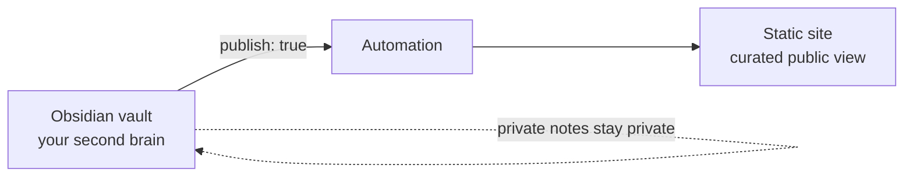

Writing happens in one place; publishing happens in another. You have a thought,
you capture it in your notes app — and then, to get it onto your site, there's a
chore list: copy it out, reformat the links, add front matter, name the file, commit,
push. The gap between *"I had an idea"* and *"it's live"* is full of friction, and
friction is where ideas quietly die.

So I asked a different question: **what if my notes app were my CMS?**

## The idea

Treat your **Obsidian vault as a headless content source** and your **static site as
a curated, read-only view of it**. You keep writing where you already think. When a
note is ready for the world, you flag it — `publish: true` — and it shows up on your
site, converted and deployed, with no copy-paste in between.

The vault is the superset — everything you write. The site is a deliberate subset —
only what you chose to share.

## Why

- **One source of truth.** Notes and posts stop drifting apart. The published version
  *is* the note; there's no second copy to keep in sync.
- **No context switch.** You write in the tool built for thinking, with backlinks and
  structure intact — not in a CMS textarea you tolerate.
- **Write freely, publish selectively.** Most notes are private thinking. A single
  flag is the only boundary between "draft in my head" and "out in public."
- **The site becomes a window into your second brain** — a chosen view, not a separate
  body of work you have to maintain by hand.

The real win is economic: **lower the cost of publishing to near zero, and you publish
more.** The chore list was a tax on every idea. Remove it and the backlog of
half-written thoughts starts to move.

## How (the shape)

The mechanics are simple to state:

1. A **publish flag** in a note's front matter marks it for the world.
2. **Automation** picks up flagged notes, converts the note's syntax to what the site
   expects, and drops it into the site's content.
3. The site **builds and deploys** itself — same as any other commit.

The interesting engineering is in step 2 (converting one tool's flavor of Markdown to
another's) and in wiring two repositories together so the whole thing runs untouched —
which is the subject of the next post.

## When it's worth it (and when it isn't)

**Worth it if:** you already live in Obsidian (or any Markdown notes app), you publish
regularly, and the friction of manual publishing is costing you posts.

**Skip it if:** it's a one-off site, your content isn't Markdown, or you publish rarely
enough that a manual copy-paste is genuinely fine. Automation you build once but
maintain forever — it has to earn its keep.

## Takeaway

A blog dies from friction, not from lack of ideas. Putting the publish button *inside*
the place you already write — and letting a pipeline do the rest — turns publishing
from a task into a side effect of thinking. Your notes app becomes your CMS, and your
site becomes the part of your mind you decided to show.

> Next up: the actual wiring — two repos, GitHub Actions, and the one loop that will
> bite you if you're not careful.
