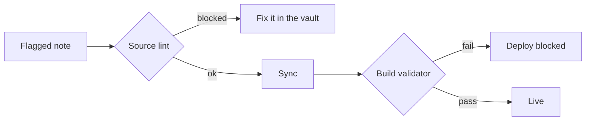

The last post was about making the pipeline run unattended. The flip side of "runs
without me" is "fails without me there to catch it." So the question that actually
decides whether you can trust the thing is: when something goes wrong — and it will —
does it fail *loud*, fail *safe*, or fail *silent*? Silent is the one that hurts.

This post is about deliberately engineering away the silent and the destructive. It's
the least glamorous work and the most important.

## The idea: hard to hurt yourself with

Publishing a good note is easy. The trust is earned on the bad inputs and the awkward
operations — a typo in the front matter, a note you decide to un-publish, a title you
rename, a post you want to go out next week. A pipeline I trust is one where none of
those quietly does the wrong thing.

Two gates, two different jobs: catch what I can at the source, and backstop the rest at
build time.

## Reject it at the source

The cheapest place to stop a broken post is before it ever leaves the vault. A small
linter runs on the vault side and inspects only the notes I've flagged to publish. It
**blocks** the sync on things that genuinely can't survive the trip — query blocks that
need the vault to exist, canvas embeds, block-level transclusions that would over-share —
and on missing required front matter. It only **warns** on things that degrade
gracefully, like an inline tag that'll render as plain text.

The point is *where* the feedback lands: in the vault, in seconds, while I'm still
writing — not as a red CI run ten minutes later, and never as a broken page.

## Make silent failures loud

The worst bug is the one that does nothing. Two bit me:

- A note with a YAML typo in its front matter would simply… never publish. No error,
  no page, no clue. Now the linter notices the note *meant* to be published and refuses
  quietly skipping it — it says so, loudly.
- A note dated in my timezone read as "the future" to a UTC build and got skipped
  silently. That one turned into a feature (scheduled publishing), but only after I made
  the skip *visible* first.

The rule I settled on: detect intent, and when you can't honor it, shout.

## Gate the deploy as a backstop

Whatever slips past the source gets caught at build time. A content validator checks the
shape of every post and project, and a link/asset check runs over the built site. If
anything's malformed or a referenced image is missing, the **build** fails — not the
live site. One bad note can break a deploy; it can never break the page that's already
serving.

## The lifecycle nobody plans for

Publishing is one verb. The pipeline has to handle the others without surprises:

- **Un-publish** — drop the flag and the post is removed, computed as a clean diff
  against the manifest. But a removal is destructive, so it's conservative: if a run
  comes back suspiciously empty (a flaky export), it refuses to delete rather than wipe
  the site. Destructive paths should second-guess themselves.
- **Rename** — change a title and the URL changes with it. Left alone, that 404s every
  link anyone ever shared. So a rename emits a redirect from the old URL to the new one;
  the bookmark keeps working.
- **Schedule** — date a note in the future and a periodic rebuild publishes it the moment
  its time actually arrives. The timezone trap from before, turned into a feature — with
  nothing sitting half-published in the meantime.

## What fought back

The hard calls weren't technical, they were judgment:

- **Block vs warn.** Block too much and the linter is a nag you'll bypass; block too
  little and breakage ships. I reserved hard blocks for *can't-render* and *over-share*,
  and let everything cosmetic through with a warning.
- **Where each check lives.** It's tempting to validate everything everywhere. But a
  check in two places is a check you'll update in one. Source lint catches authoring
  mistakes; the build gate catches everything else. No overlap by design.

## Takeaway

The difference between a script and a system is how it behaves on the day something's
wrong. Validate early, fail loud instead of silent, gate the irreversible behind a build,
and make every destructive path conservative by default. None of it is clever. All of it
is the reason I can flag a note, walk away, and trust what ends up on the site.

> That's the series: the *why*, the wiring, running it unattended, and designing for the
> bad days. The whole thing exists so publishing can go back to being an afterthought —
> which was the point all along.
