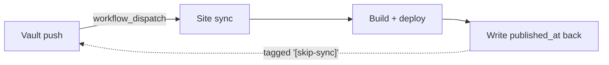

The wiring from the last post got me a demo: push the vault, watch a post appear. That
felt like the finish line. It wasn't — it was the easy 20%. The rest was making the
thing *run itself* — unattended, across two repos, surviving the cases I hadn't thought
of on day one. That part looks a lot less like a clever hack and a lot more like
ordinary DevOps, which is exactly why it's the part worth writing down.

## The idea: it has to run without me

A demo runs once, while you watch. A pipeline runs whenever a push happens, while you're
asleep, on inputs you didn't anticipate. The bar isn't "it published a post" — it's "I
can ignore it for a month and trust what's on the site."

That reframes everything. Now I care about state, repeatability, and failure — not just
the happy path.

## The shape, running

Three operational ideas are what turned the demo into something I trust.

### State lives in a manifest

The sync writes a small `manifest.json` recording exactly what each run produced — every
output file and copied asset. Without that record, the pipeline is amnesiac: it can
publish, but it can't know what to *remove* when a note is un-published, or what the old
URL was when a note is renamed. The manifest is the single source of truth for "what did
I put on the site last time," and almost every non-trivial feature leans on it.

### Idempotent, or it loops

Re-running the sync on unchanged input has to produce *nothing* — no file changes, no
commit, no deploy. This isn't just tidiness: it's what keeps the write-back from spinning
forever (more below), and what keeps a stray re-trigger from costing a build. If nothing
real changed, the run converges to a no-op.

### Selective, or it's noisy

Most vault pushes don't touch anything published — I edit private notes constantly. So
the trigger asks one question before doing anything: *did a note that's actually
published change?* A draft edit shouldn't burn a build-and-deploy. Cheap to check, and it
turns a chatty pipeline into a quiet one.

## What fought back

The happy path took an afternoon. These took the rest of the time.

### The loop that eats your Actions minutes

Writing `published_at` back to the vault is a commit. That commit is a push. That push
re-fires the trigger, which runs the sync, which writes again… I designed for this before
the first real run: the write-back commit is tagged `[skip-sync]`, and the vault's
trigger skips any commit carrying it. The pipeline writes back exactly once and stops.

### Two builds, one deploy target

A scheduled rebuild and a content sync can fire close together, and both end up deploying
to the same Pages environment — a race, with one clobbering the other. The fix was
boring and correct: put both workflows in one **concurrency group** with
cancel-in-progress off, so they queue instead of collide. Never cancel a run mid
content-commit.

### The post that wouldn't appear

I dated a note for "today," pushed, and it never showed up. No error — just absent. The
build runs in UTC; I write in UTC+6, six hours ahead. To the build clock, "today" was
still the future, so the static-site generator quietly skipped it. The fix wasn't to
force future posts on — it was understanding that a timestamp is an absolute instant, and
letting a periodic rebuild publish it the moment its time genuinely arrives.

### The bug the unit tests couldn't see

One of my Markdown transforms passed every unit test I wrote. Then the real exporter ran
and escaped the brackets in its output — `\[!tip\]` instead of `[!tip]` — and my pattern
matched nothing. The lesson was cheap and permanent: test against the *actual tool's
output*, end to end, not against your mental model of it. The local run that exercised
the real exporter caught in seconds what a hundred unit tests had missed.

### Don't delete everything on a bad day

Un-publishing a note should remove its post — the manifest makes that a clean diff. But
what if the exporter hiccups and hands back *zero* notes? "Remove everything that's gone"
would then cheerfully wipe the entire site. So the cleanup refuses to run when the result
looks suspiciously empty: it treats a mass deletion as a bug to be questioned, not an
instruction to be obeyed. A pipeline should be hard to hurt yourself with.

## Takeaway

A publishing pipeline isn't done when it publishes. It's done when un-publishing,
renaming, scheduling, and *failing* are all handled — and when it can run for weeks
without anyone watching. Getting the first post to appear was a weekend. Making it
something I'd trust unattended was the real project, and it's the half that actually
demonstrates the engineering: state, idempotency, concurrency, and designing for the bad
day before it arrives.

> Speaking of the bad day — the next post is entirely about it: validating bad input,
> failing loud instead of silent, and handling the awkward verbs (un-publish, rename,
> schedule) without surprises.
