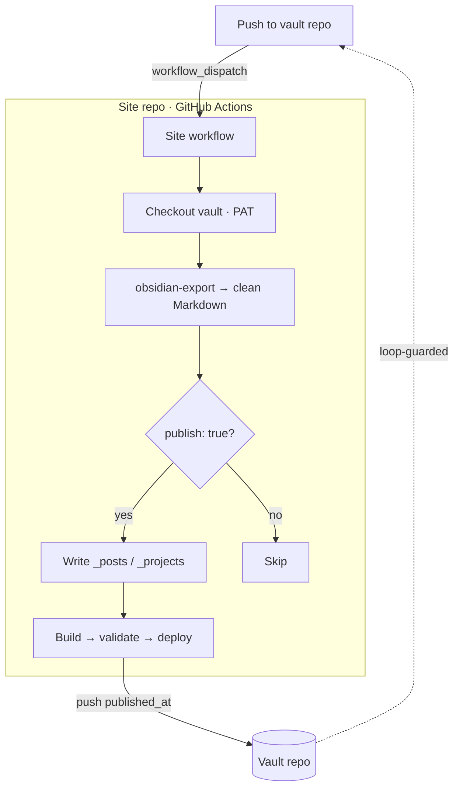

Treating your notes app as your CMS is the idea; this post is the wiring. Two
repositories — a **private vault** (the source) and a **static site** (the published
view) — connected so that pushing to the vault makes the site rebuild itself, and the
site writes a status back to the vault when it's done.

## The architecture



Three things have to cross the repo boundary, and GitHub Actions has a primitive for
each.

## 1. Trigger one repo from another

The vault's `on: push` workflow makes one authenticated API call that fires the site's
**`workflow_dispatch`** — so the site side only has to listen for that:

```yaml
on:
  workflow_dispatch:
```

The vault side is a single `curl` to the dispatch endpoint:

```yaml
- run: |
    curl -fsS -X POST \
      -H "Authorization: Bearer ${{ secrets.SITE_DISPATCH_TOKEN }}" \
      https://api.github.com/repos/you/your-site/actions/workflows/sync.yml/dispatches \
      -d '{"ref":"main"}'
```

(`repository_dispatch` is the other option; I went with `workflow_dispatch` because the
target is one specific workflow.) That's the "magic happens in the background" link — a
vault push becomes a site build.

## 2. Pull a private repo into the workflow

The site workflow checks out the vault with `actions/checkout`, authenticated by a
**fine-grained PAT** (the vault is private):

```yaml
- uses: actions/checkout@v4
  with:
    repository: you/your-vault
    token: ${{ secrets.VAULT_TOKEN }}
    path: vault
```

## 3. Convert the content — don't reinvent it

Obsidian Markdown isn't standard Markdown: `[[wikilinks]]`, `![[embeds]]`, attachments.
Rather than hand-roll that, run **`obsidian-export`** (a Rust CLI) to emit clean
Markdown, then filter by the publish flag and drop the survivors into `_posts` /
`_projects`. A build-time **content validator** then gates the deploy, so a malformed
note can never reach the live site.

## The gotcha: the write-back loop

The nice touch — writing `published_at` back to the note so the vault knows it's live —
is also the trap. The site pushes a commit to the vault → that push re-fires the
"vault updated" trigger → the site runs again → and around it goes.

Break the cycle deliberately, with **one** of:

- the vault's trigger workflow **ignores commits tagged `[skip-sync]`** (what I did — the
  write-back commit carries it, so the trigger skips its own echo),
- a **`paths-ignore`** so front-matter-only write-backs don't trigger, or
- make the sync **idempotent** — if nothing real changed, it's a no-op and converges.

This is the part that bites people; design it in from the start, not after the first
infinite loop drains your Actions minutes.

## Auth, in one line

A **fine-grained PAT** (or a **GitHub App**, if you want short-lived tokens and tighter
scopes) with **read + write on the vault** and **dispatch on the site repo**, stored as
secrets. One credential wires all three moves above.

## Pitfalls to watch

- **The loop** — covered above; the #1 way this goes wrong.
- **Token scope** — least privilege; a leaked broad PAT touches both repos.
- **Conversion fidelity** — test embeds/attachments early; that's where Obsidian and
  plain Markdown diverge most.
- **No validation gate** — without it, one bad note breaks a live page. Gate the deploy.

## Takeaway

Cross-repo automation in GitHub Actions comes down to three primitives — a
`workflow_dispatch` to trigger, an authenticated `checkout` to pull, and an
authenticated push to write back. Lean on `obsidian-export` for the hard conversion,
guard the write-back loop, and gate the deploy with validation. The result is the
payoff from Part 1: you write and flag a note, and a pipeline quietly turns it into a
deployed page.

> Next up: getting it *working* was the easy part. The next post is the unglamorous
> half — making the pipeline run itself unattended, and the bugs that only show up once
> it's actually running.
