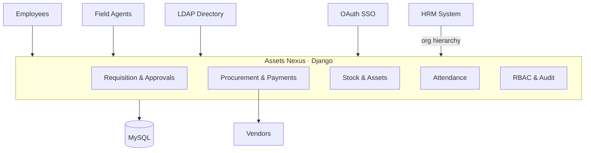
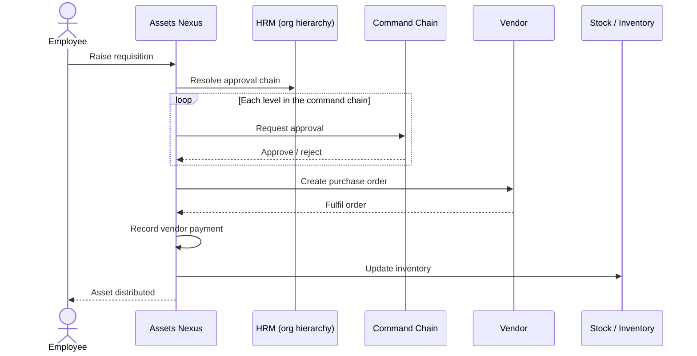
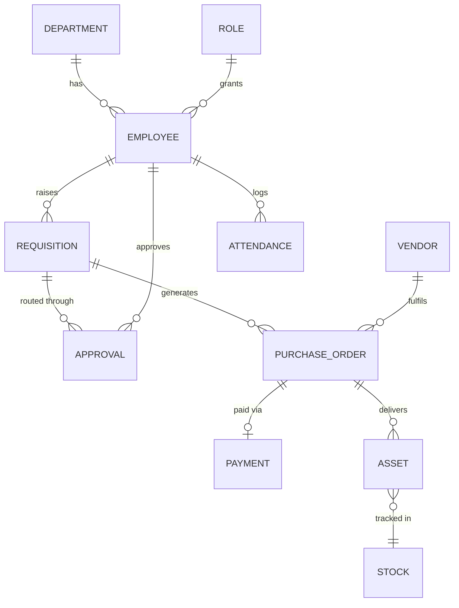


> [Source]({{ page.source }}) · [Live demo]({{ page.demo }})


## At a glance

| | |
|---|---|
| **Role** | R&D Engineer — sole developer |
| **Company** | ISTL (Integrated Software and Technologies Limited) |
| **Timeline** | During Jul 2020 – Feb 2023 |
| **Team** | Solo |
| **Users** | 250+ employees & field agents |
| **Modules** | Requisition · Procurement · Payments · Stock/Assets · Attendance |
| **Stack** | Django · Python · MySQL · Docker · LDAP / OAuth · Linux |
| **Status** | Deployed internally |

## Problem & context

ISTL needed to run its internal operations for **250+ employees and field agents** —
raising requests, routing them through layers of approval, ordering from vendors,
paying them, tracking stock, and recording attendance. Done manually, it was slow
and hard to audit. I built **Assets Nexus**, **solo**: a SaaS platform that
centralizes the entire requisition → approval → procurement → distribution
lifecycle, plus stock and attendance. Every device it ran on was secured by
[Data Citadel](/projects/data-citadel/).

## Modules

- **Requisition & approvals** — requests routed through the org command chain.
- **Procurement & vendor management** — purchase orders and vendor records.
- **Vendor payments** — payment tracking against purchase orders.
- **Stock & asset management** — inventory, distribution, and returns.
- **Attendance** — check-in/out for employees and field agents.
- **Access & audit** — role-based access via LDAP/OAuth identities, with an audit
  trail and reporting dashboards.

## Architecture

A **Django** application backed by **MySQL**, containerized with **Docker** on
**Linux**. Authentication uses **LDAP** for directory/login and **OAuth** for SSO,
while an **HRM** integration supplies the employee and **organizational
hierarchy** that drives the approval chain. Employees and field agents work
across the modules through one role-based interface.

## Key flow

The requisition lifecycle — request through the command chain to distribution.

## Data model

Employees, requisitions, approvals, vendors, stock, and attendance.

## What I built

- A **Django SaaS platform** unifying requisition, procurement, stock, and
  attendance for the whole organization.
- A **multi-level approval workflow** that routes each requisition dynamically
  through the **organizational command chain** sourced from HRM.
- **Identity & access** — LDAP directory/login, OAuth SSO, HRM employee data, and
  **role-based access control** with an **audit trail**.
- **Order management** and **vendor payment** tracking through purchase orders.
- **Stock/inventory management** with asset distribution and returns.
- An **attendance** module for employees and field agents.
- **Dockerized deployment** on Linux, with endpoints hardened by Data Citadel.

## Challenges & trade-offs

- **Dynamic approval chains** — different departments have different hierarchies,
  so the engine resolves the right chain of approvers per requisition from the
  live org structure rather than hard-coded levels.
- **Stock consistency** — keeping inventory accurate across concurrent
  procurement, distribution, and returns.
- **Field-agent attendance** — recording attendance reliably for agents working
  away from the office.

## Outcome

- Served **250+ employees and field agents** across the organization.
- **Boosted procurement efficiency ~20%** and **reduced asset costs ~15%**.
- Replaced a slow, manual, hard-to-audit process with a single auditable platform
  spanning requisition, approval, procurement, payment, stock, and attendance.
