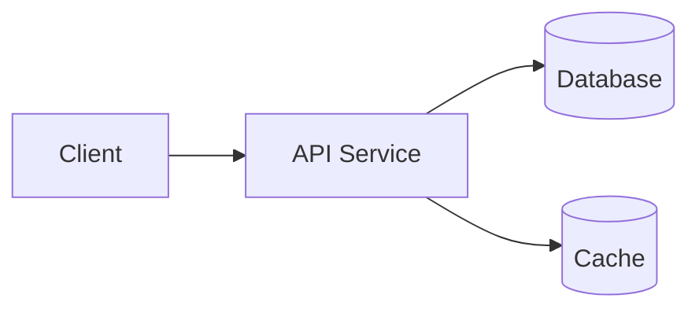
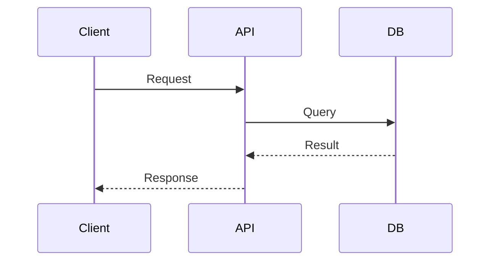
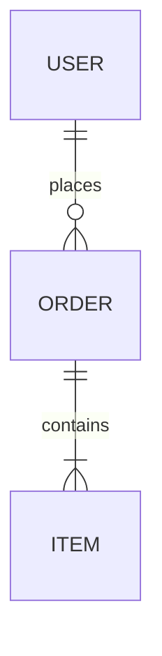


> [Source]({{ page.source }}) · [Live demo]({{ page.demo }})


## At a glance

| | |
|---|---|
| **Role** | TODO |
| **Timeline** | TODO |
| **Team** | TODO |
| **Stack** | Django · Python · MySQL · Docker · Linux |
| **Status** | TODO |

## Problem & context

TODO — what problem this solves and why it mattered.

## Architecture

TODO — short prose, then the system view.

## Key flow

TODO — one important request/process.

## Data model

TODO — core entities.

## What I built

TODO — your ownership and key design decisions / trade-offs.

## Outcome

TODO — impact, metrics, or lessons learned.
