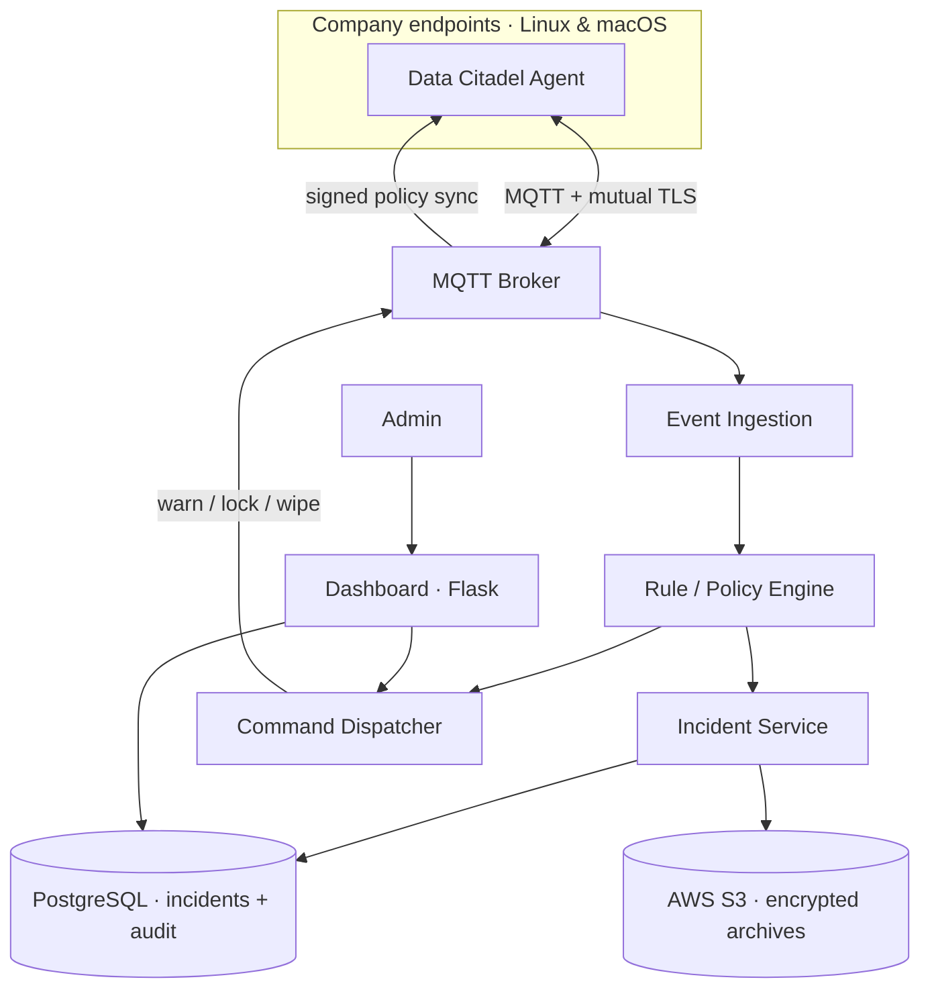
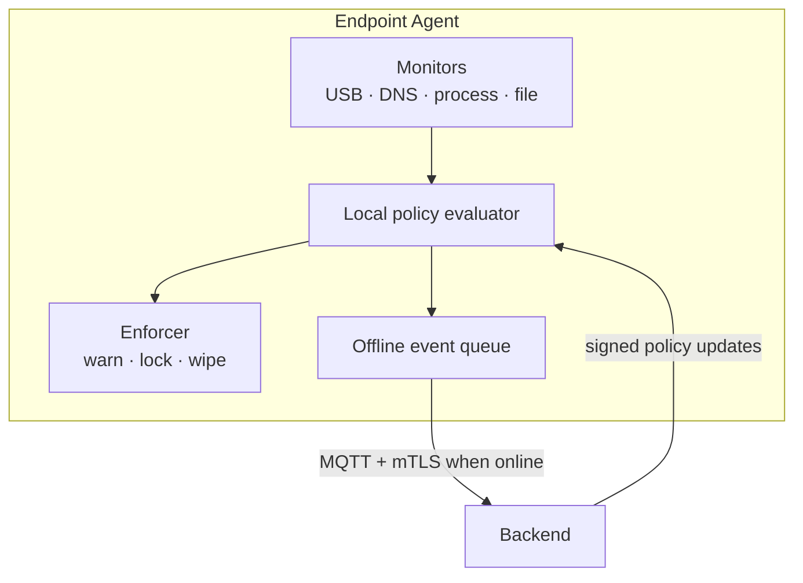
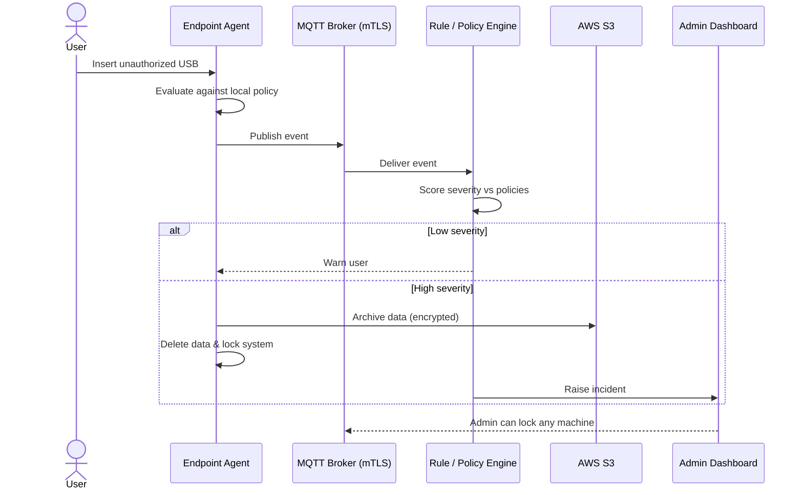
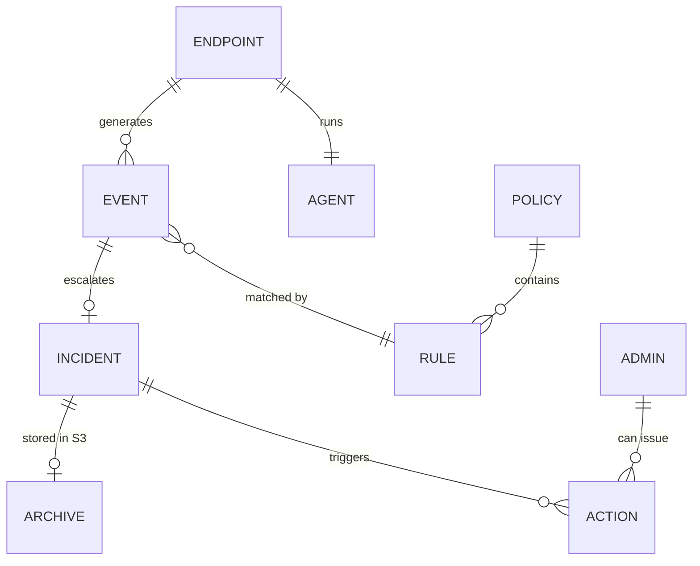

## At a glance

| | |
|---|---|
| **Role** | R&D Engineer — sole architect & developer |
| **Company** | ISTL (Integrated Software and Technologies Limited) |
| **Timeline** | During Jul 2020 – Feb 2023 |
| **Team** | Solo |
| **Stack** | Python · MQTT (mTLS) · Flask · PostgreSQL · AWS S3 · Linux · macOS |
| **Transport** | MQTT over mutual TLS |
| **Fleet** | 50+ endpoints holding confidential government data |
| **Status** | Deployed company-wide |

## Problem & context

Endpoints are the soft underbelly of corporate security — an inserted USB drive
or a visit to a malicious site can exfiltrate data in seconds. These machines held
**confidential government data**, so a single leaked drive could expose highly
sensitive information. The company needed real-time visibility and control over
every machine. I designed and built
**Data Citadel** end to end, **solo**: a lightweight agent on every Linux & macOS
machine, a policy-driven backend, and an admin console for fleet-wide monitoring
and lockdown.

## Capabilities

- **Removable-media control** — detects unauthorized USB/storage devices.
- **Web egress control** — blocks unauthorized sites via DNS inspection.
- **Policy-driven severity** — many configurable rules map activity to a response.
- **Graduated enforcement** — *warn → lock → wipe* depending on severity.
- **Forensic response** — offending data is archived (encrypted) to S3 before deletion.
- **Fleet console** — admins monitor every machine and lock any of them on demand.
- **Tamper-resistant agent** with offline enforcement when disconnected.

## Architecture

A lightweight **Python agent** runs as a privileged daemon on each endpoint,
watching locally for suspicious activity — USB device events, **DNS lookups** to
unauthorized sites, and process/file activity. Each agent has a **per-device
identity** and connects to the backend over **MQTT secured with mutual TLS**.

The backend is a set of **microservices**: **event ingestion**, a **rule/policy
engine** (many versioned, centrally-managed policies that decide severity), an
**incident service**, and a **command dispatcher** that pushes actions —
*warn / lock / wipe* — back to agents. Signed policy updates are synced securely
to agents over the same channel. A **Flask** admin **dashboard** provides
real-time fleet status and one-click lockdown; incidents and audit logs live in
**PostgreSQL**, and encrypted forensic archives are stored in **AWS S3**.

## Agent internals

The agent evaluates policies **locally** so enforcement keeps working even
offline, queuing events to sync when the connection returns.

## Key flow

An unauthorized USB drive — detection through severity-based forensic response.

## Data model

Endpoints, events, policies, incidents, and audit trail.

## What I built

A complete endpoint security platform, solo:

- **Python endpoint agent** for Linux & macOS — USB monitoring, DNS-based site
  checks, and local policy evaluation with **offline enforcement**.
- **MQTT over mutual TLS** transport with **per-device identity** for agent↔backend comms.
- **Rule/policy engine** with versioned, centrally-managed policies that score
  severity and select the response.
- **Real-time incident response** — encrypt and archive offending data to **S3**,
  delete it, then **warn or lock** the machine by severity.
- **Command dispatcher** for remote *warn / lock / wipe*.
- **Flask admin dashboard** for real-time fleet monitoring, incident review, and
  one-click lockdown — with a full **audit trail** of admin actions.

## Challenges & trade-offs

- **Dynamic policy engine** — the hardest part was letting policies change live
  across the fleet without redeploying agents: rules are evaluated locally on each
  endpoint, yet stay centrally managed and versioned so a single policy update
  propagates everywhere securely.
- **USB tracking** — reliably catching and acting on removable-media events across
  **both Linux and macOS** (each with its own device subsystem) fast enough to
  archive and wipe before data could be copied off.

## Outcome

- Protected a fleet of **50+ machines** holding **confidential government data**,
  giving admins real-time visibility and instant lockdown of any machine.
- Handles **~5–6 incidents per day** with automated, severity-based response.
- From an unauthorized USB insertion to **system lockdown in under ~5 minutes**,
  with an encrypted forensic archive preserved for every incident.
- **~90% fleet uptime** across the deployment.
