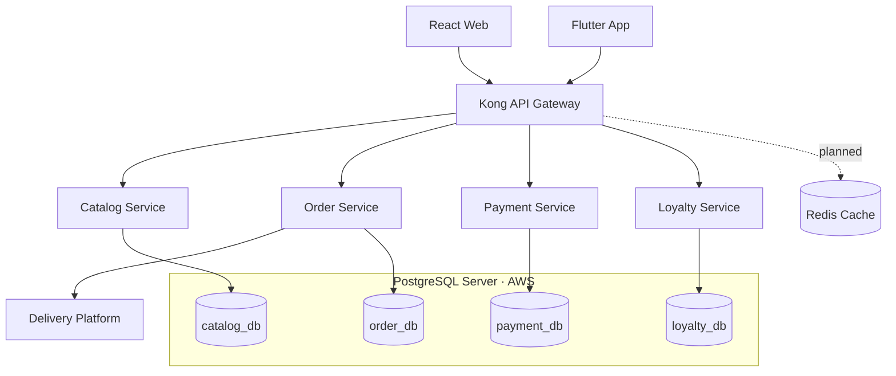
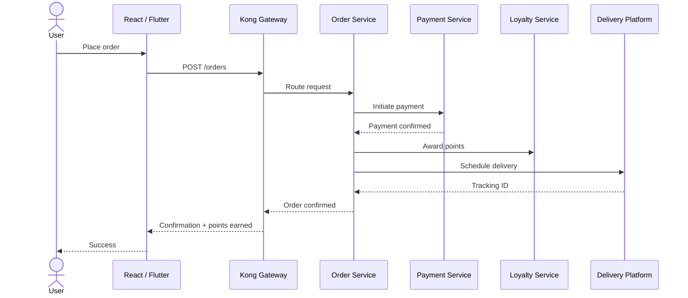
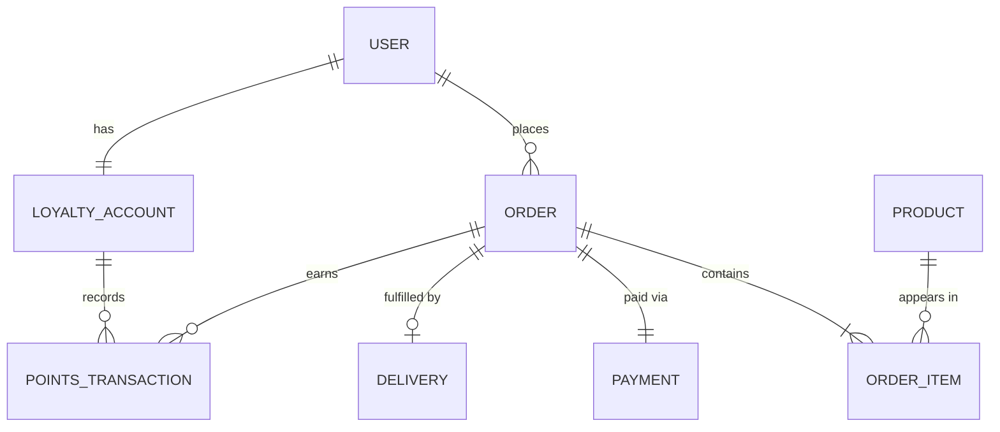


> [Source]({{ page.source }}) · [Live demo]({{ page.demo }})


## At a glance

| | |
|---|---|
| **Role** | Technical Project Lead — overall technical lead across backend, frontend, mobile & UX |
| **Company** | TecnoBZ (KM Group) |
| **Timeline** | Mar 2024 – present |
| **Team** | 2 backend · 2 frontend · 2 mobile · 2 UX, plus a project manager |
| **Stack** | Django · React · Flutter · PostgreSQL · AWS · Kong |
| **Status** | Live at [shob.com.bd](https://shob.com.bd) |

## Problem & context

SHOB.COM.BD is a B2B **and** B2C e-commerce platform for Bangladesh — wholesale
(Alibaba-style) and retail (Amazon-style) in one marketplace. When I joined,
onboarding and basic functionality existed, but the system was a **monolith**,
order management and payment handling were **stubs**, and it was not ready to go
live at scale.

## Architecture

I re-architected the monolith into **microservices behind a Kong API gateway**.
Web (React) and mobile (Flutter) clients hit Kong, which routes to focused
**Django** services backed by a single **PostgreSQL server on AWS**, with a
**separate database per service**. Authentication is handled within Django. Order
fulfilment integrates with the company's external **delivery platform**. A Redis
cache was designed but left as planned work, and there is no message broker —
services communicate synchronously. The codebase follows Django's **MVT**
(Model–View–Template) structure.

## Key flow

Checkout — the path that ties order, payment, loyalty, and delivery together.

## Data model

Core entities around orders, payments, and the loyalty program.

## What I built

- **Monolith → microservices** behind a Kong API gateway.
- Built **order management** and **payment method handling** out from stubs to
  production features.
- Designed and shipped the **loyalty program** (points earned and redeemed at checkout).
- **Backend stabilization** and **high-traffic handling** to make the platform production-ready.
- **Integrated the company's delivery platform** into the order lifecycle.

## Outcome

After these improvements the platform **went live and was a success** — a stable,
scalable backend serving both B2B and B2C customers in Bangladesh.
