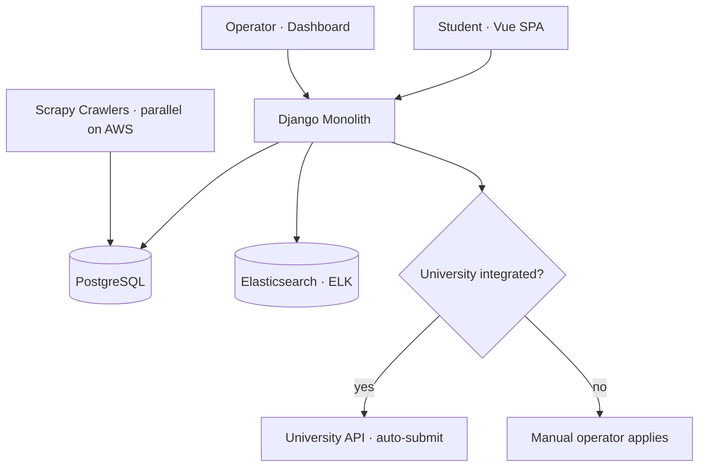
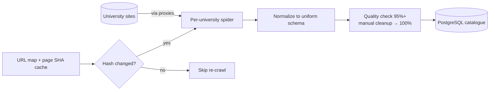
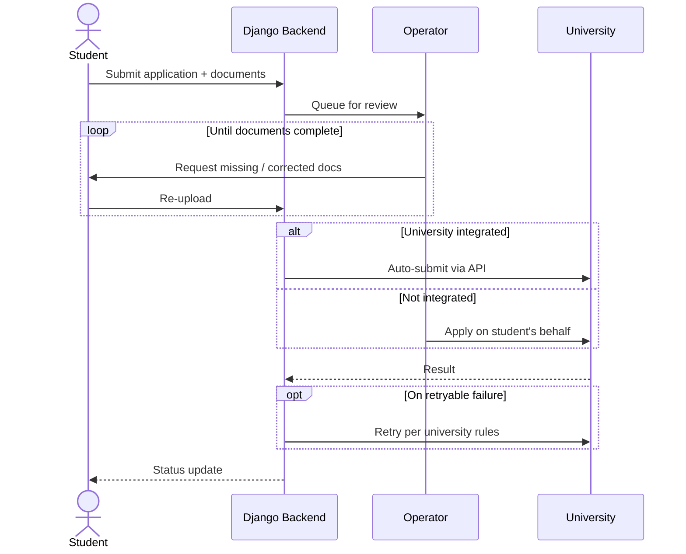
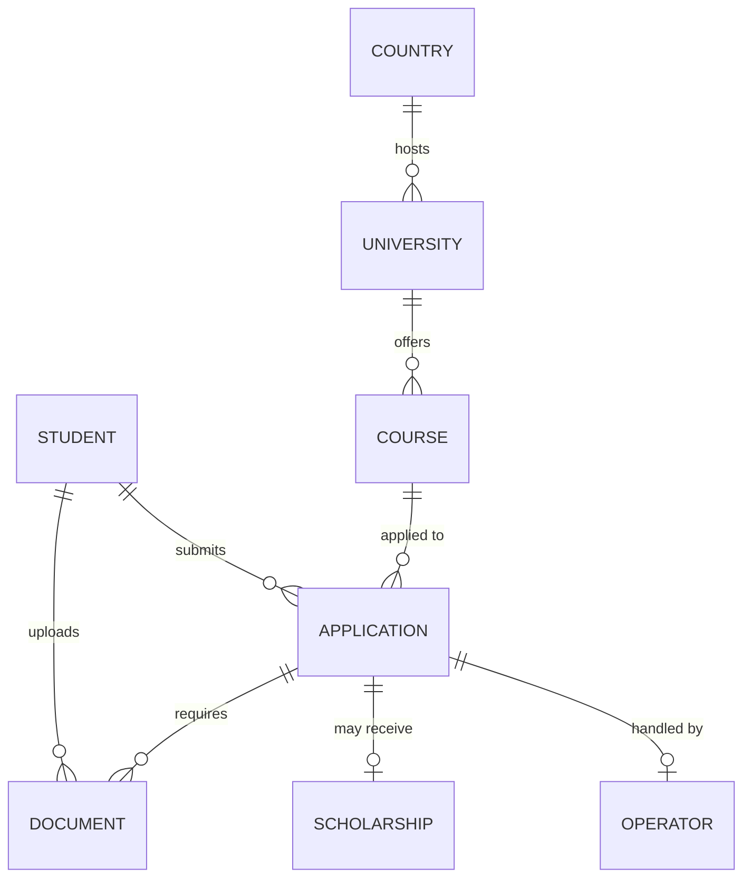

## At a glance

| | |
|---|---|
| **Role** | Tech Lead — backend |
| **Company** | YGBL (Young Genius Bangladesh Limited) |
| **Timeline** | Mar 2023 – Mar 2024 |
| **Team** | Me (tech lead / backend) · 2 frontend · 1 intern · 1 UX |
| **Stack** | Django · Vue · PostgreSQL · Scrapy · Elasticsearch · Docker |
| **Catalogue** | 1,500+ universities · 30+ countries · ~17,000 courses |
| **User roles** | Student · Operator · Data entry · Admin · Super admin |
| **Status** | Live |

## Problem & context

Study Giveaway (studygiveaway.com) helps students pursue **higher study abroad**.
Discovering the right universities and courses worldwide — and navigating each
institution's application process — is fragmented and hard. The platform
centralizes a **global university catalogue** and streamlines applications, with
the goal of getting students **admitted with the best possible scholarship**. It
also provides **manual accommodation services** to help students settle in.

## Architecture

A **Vue** single-page app talks to a **monolithic Django** backend over a REST
API, backed by **PostgreSQL**. Search is served by **Elasticsearch (ELK)**
alongside **PostgreSQL full-text search**. A fleet of **Scrapy** crawlers running
in **parallel on AWS** keeps the catalogue fresh. Applications follow a **dual
path** — automated submission via a university's **API** when integrated, or a
**manual operator** applying on the student's behalf otherwise — with document
review and rule-based retries in between. Deployed on AWS.

## Data pipeline

Each university has its own **spider variant** — a shared output schema, but
custom selectors per site. A scheduled job caches each site's **URL map and
page-content SHA**, then re-crawls only when the hash changes; results are
normalized, quality-checked (**95%+ automated**, topped to ~100% with manual
cleanup), and written to the catalogue. Proxies handle rate limiting.

## Key flow

The application lifecycle — document review, then automated or manual submission.

## Data model

Catalogue, students, documents, and applications.

## What I built

- Designed and built the **monolithic Django backend** and REST API.
- **Scraping engine** — a **per-university spider variant** (shared output schema,
  custom selectors per site), run **in parallel on AWS** with **proxy rotation**
  for rate limiting.
- **Incremental crawling** — cached each site's **URL map and page-content SHA**;
  a scheduled job re-scrapes only when the content hash changes.
- **Data quality** — 95%+ automated accuracy, topped to ~100% with manual cleanup.
- **Search** via **Elasticsearch (ELK)** + **PostgreSQL full-text** for fast
  university/course discovery.
- **Application lifecycle engine** — backend document review, student↔operator
  back-and-forth for document completion, then automated (API) or manual
  submission per university, with **rule-based retries** on failure.
- **Role-based access** for five user types: student, operator, data entry,
  admin, super admin.

## Outcome

- Built a catalogue of **1,500+ universities across 30+ countries** with
  **~9,000 undergraduate**, **~6,000 master's**, and **~2,000 PhD** courses
  (≈17,000 in total), kept fresh by the Scrapy crawlers.
- Over my **1+ year**, **~96 students** applied through the platform with an
  **~70% application success rate**.
- Turned a fragmented, manual process into a single platform spanning discovery,
  application, scholarship, and accommodation support.
